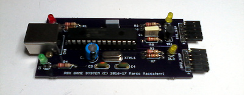

## P8X Game System PropPlug

USB programming interface for the [P8X Game System](https://dev.maccasoft.com/propgame).

Seen by the operating system as two serial ports compatible with Parallax Prop-plug.

**Windows**
 * GPU_ICSP = COM15
 * CPU_ISCP = COM16

**Linux**
 * GPU_ICSP = /dev/ttyACM0
 * CPU_ISCP = /dev/ttyACM1

_**Note:** Actual port numbers may vary depending on other USB devices plugged on the system._

**Parts List**

 * R1 = 220 ohm 1/4 watt
 * R2 = 220 ohm 1/4 watt
 * R3 = 220 ohm 1/4 watt
 * R4 = 220 ohm 1/4 watt
 * R5 = 33.000 ohm 1/4 watt
 * R6 = 10.000 ohm 1/4 watt
 * R7 = 10.000 ohm 1/4 watt
 * R8 = 10.000 ohm 1/4 watt
 * C1 = 100.000 pF poli
 * C2 = 10 uF 63v elettr.
 * C3 = 22 pF disc
 * C4 = 22 pF disc
 * C5 = 10.000 pF poli
 * DL1 = Red LED
 * DL2 = Yellow LED
 * DL3 = Yellow LED
 * DL4 = Green LED
 * XTAL1 = 12 MHz crystal
 * IC1 = PIC18F24J50
 * TR1 = Transistor BC547
 * CN1 = USB-B connector

PCBs are shared on [OSH Park](https://oshpark.com) and can be ordered from there:  
[https://oshpark.com/shared_projects/9SPZhAax](https://oshpark.com/shared_projects/9SPZhAax)
